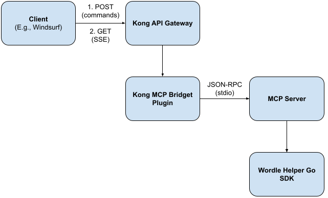

# kong-plugin-poc

POC of a Kong plugin (written in Go) that routes HTTP API calls to an MCP server using stdio to deliver Wordle suggestions.

## Architecture

This project demonstrates a complete integration between Kong Gateway and an MCP (Model Context Protocol) server:

- **Kong Gateway**: Routes HTTP requests and loads the custom Go plugin
- **Kong MCP Bridge Plugin** (Go): Intercepts requests, spawns MCP server, handles JSON-RPC communication
- **MCP Server** (Go): Provides Wordle suggestions via the `get_wordle_suggestions` tool

## Request Flow



1. Client sends HTTP POST to `/mcp/wordle`
2. Kong routes to Go plugin's `Access()` handler
3. Plugin spawns MCP server using `exec.Cmd`
4. Plugin sends MCP requests to MCP server via stdin:
   - a. Plugin sends "initialize" JSON-RPC request
   - b. Plugin sends "notifications/initialized" JSON-RPC request
   - c. Plugin sends "tools/call" JSON-RPC request, reads JSON-RPC response from stdout
5. Plugin returns HTTP response to Kong
6. Kong returns to client

## Prerequisites

- Maker sure Docker is installed and running
- Install [decK](https://developer.konghq.com/deck/) CLI version 1.43 or later

## Get Started

### Quick Start

```bash
# Build and start Kong with the MCP plugin
make run-kong

# Test the integration
make test-kong
```

### Step-by-Step

**1. Test the MCP server standalone:**
```bash
make test-mcp
```

**2. Build and run Kong:**
```bash
make run-kong
```

**3. Verify Kong is running:**
```bash
curl http://localhost:8001/status
```

**4. Test the MCP integration:**
```bash
curl -X POST http://localhost:8000/mcp/wordle \
  -H "Content-Type: application/json" \
  -d '{"guesses": ["slate", "crane"]}'
```

Expected response:
```json
{"suggestions": ["apple"]}
```

**5. Run all tests:**
```bash
make test-kong
```

## Project Structure

```
.
├── kong-plugin-mcp/          # Go Kong plugin
│   ├── main.go               # Plugin handler
│   ├── config.go             # Configuration schema
│   ├── mcp_client.go         # MCP communication
│   └── Makefile              # Plugin build
├── mcp_server/               # MCP server
│   ├── main.go               # Server entry point
│   ├── wordlemcpserver/      # Wordle tool implementation
│   └── test_request.sh       # Standalone test
├── kong/
│   ├── Dockerfile            # Kong image with plugin
│   └── kong.yml              # Kong declarative config
├── test_kong_mcp.sh          # Integration tests
└── Makefile                  # Main build automation
```

## Reference

### MCP Server

```bash
make build-mcp  # Build MCP server binary
make test-mcp   # Build and run standalone test
make clean-mcp  # Remove built files
```

### Kong Plugin

```bash
make build-plugin  # Build Go plugin (.so file)
make clean-plugin  # Remove built files
```

### Kong Gateway

```bash
make build-kong  # Build Docker image with plugin and MCP server
make run-kong    # Build and run Kong in background
make logs-kong   # View Kong logs
make test-kong   # Run integration tests
make stop-kong   # Stop the container
make clean-kong  # Remove Docker image
```

### All

```bash
make all    # Build everything
make clean  # Clean everything
```

## More Info

- [Get started with Kong Gateway](https://developer.konghq.com/gateway/get-started/)