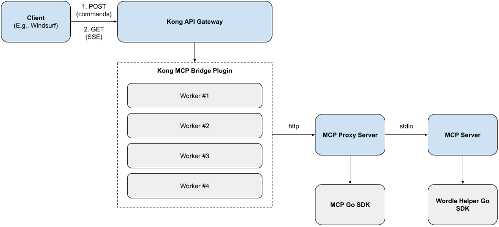

# kong-plugin-poc

POC of custom Wordle MCP server that is routed to a client (e.g., Windsurf) via a Kong Gateway plugin.

This project can be built & ran locally.

## Architecture



Key components:

- **Kong Gateway**: Routes HTTP requests and provides API gateway features (auth, rate limiting, etc.)
- **Kong MCP Bridge Plugin** (Go): Simple HTTP proxy that forwards requests to MCP HTTP Proxy
- **MCP HTTP Proxy** (Go + MCP SDK): Implements Streamable HTTP transport (SSE), handles MCP protocol
- **MCP Server** (Go): Provides Wordle suggestions via the `get_wordle_suggestions` tool

## Request Flow

```
┌─────────────────┐
│ MCP Client      │ (Windsurf, curl, etc.)
│ (Streamable     │
│  HTTP/SSE)      │
└────────┬────────┘
         │ HTTP POST/GET (port 8000)
         ↓
┌─────────────────┐
│ Kong Gateway    │ (API Gateway - routing, auth, rate limiting)
└────────┬────────┘
         │ HTTP forward
         ↓
┌─────────────────┐
│ Kong MCP Bridge │ (Simple HTTP proxy plugin)
│ Plugin (Go)     │
└────────┬────────┘
         │ HTTP (port 9000, internal)
         ↓
┌─────────────────┐
│ MCP HTTP Proxy  │ (MCP Go SDK - handles SSE, sessions, protocol)
│ (Go + SDK)      │
└────────┬────────┘
         │ stdio JSON-RPC
         ↓
┌─────────────────┐
│ MCP Server      │ (Wordle tool implementation)
│ (Go)            │
└─────────────────┘
```

## Prerequisites

- Maker sure Docker is installed and running
- Install [decK](https://developer.konghq.com/deck/) CLI version 1.43 or later

## Get Started

### Quick Start

```bash
# Build and start Kong with the MCP plugin
make run-kong

# Test the integration
make test-kong
```

### Step-by-Step

**1. Test the MCP server standalone:**
```bash
make test-mcp
```

**2. Build and run Kong:**
```bash
make run-kong
```

**3. Verify Kong is running:**
```bash
curl http://localhost:8001/status
```

**4. Test the MCP integration:**
```bash
# Initialize MCP session
curl -X POST http://localhost:8000/mcp/wordle \
  -H "Content-Type: application/json" \
  -d '{
    "jsonrpc": "2.0",
    "id": 1,
    "method": "initialize",
    "params": {
      "protocolVersion": "2024-11-05",
      "capabilities": {},
      "clientInfo": {"name": "test", "version": "1.0.0"}
    }
  }'

# Call the Wordle tool
curl -X POST http://localhost:8000/mcp/wordle \
  -H "Content-Type: application/json" \
  -d '{
    "jsonrpc": "2.0",
    "id": 2,
    "method": "tools/call",
    "params": {
      "name": "get_wordle_suggestions",
      "arguments": {"guesses": ["slate", "crane"]}
    }
  }'
```

Expected response (SSE format):
```
event: message
id: <session_id>_0
data: {"jsonrpc":"2.0","id":2,"result":{"content":[{"type":"text","text":"{\"suggestions\":[\"apple\"]}"}]}}
```

**5. Run test script:**
```bash
./test_streamable_http.sh
```

## Project Structure

```
.
├── kong-plugin-mcp/          # Kong plugin (HTTP proxy)
│   ├── main.go               # Plugin entry point
│   ├── config.go             # Configuration schema
│   ├── http_proxy.go         # HTTP forwarding handler
│   └── Makefile              # Plugin build
├── mcp-http-proxy/           # MCP HTTP Proxy service
│   ├── main.go               # Proxy using MCP Go SDK
│   └── go.mod                # Go module with SDK dependency
├── mcp_server/               # MCP server
│   ├── main.go               # Server entry point
│   ├── wordlemcpserver/      # Wordle tool implementation
│   └── test_request.sh       # Standalone test
├── kong/
│   ├── Dockerfile            # Kong image with all components
│   ├── kong.yml              # Kong declarative config
│   └── start.sh              # Startup script (runs proxy + Kong)
├── test_streamable_http.sh   # Streamable HTTP tests
├── WINDSURF_SETUP.md         # Windsurf integration guide
├── IMPLEMENTATION_SUMMARY.md # Technical details
└── Makefile                  # Main build automation
```

## Reference

### MCP Server

```bash
make build-mcp  # Build MCP server binary
make test-mcp   # Build and run standalone test
make clean-mcp  # Remove built files
```

### Kong Plugin

```bash
make build-plugin  # Build Go plugin (.so file)
make clean-plugin  # Remove built files
```

### Kong Gateway

```bash
make build-kong  # Build Docker image with plugin and MCP server
make run-kong    # Build and run Kong in background
make logs-kong   # View Kong logs
make test-kong   # Run integration tests
make stop-kong   # Stop the container
make clean-kong  # Remove Docker image
```

### All

```bash
make all    # Build everything
make clean  # Clean everything
```

## Windsurf Integration

This Kong MCP proxy can be used with Windsurf and other MCP clients that support Streamable HTTP transport.

**Add to `~/.codeium/windsurf/mcp_config.json`:**

```json
{
  "mcpServers": {
    "wordle-kong-proxy": {
      "disabled": false,
      "headers": {},
      "serverUrl": "http://localhost:8000/mcp/wordle"
    }
  }
}
```

After restarting Windsurf, you'll have access to the `get_wordle_suggestions` tool.

## More Info

- [Get started with Kong Gateway](https://developer.konghq.com/gateway/get-started/)
- [MCP Specification](https://spec.modelcontextprotocol.io/)
- [MCP Go SDK](https://github.com/modelcontextprotocol/go-sdk)

## FAQ

### Why not combine the MCP HTTP Proxy and MCP Server into one component?

The key reason is that there's a mismatch between the MCP SDK and Kong's plugin model, and working around these differences would result in significant complexity. Some of these challenges include:

- **Response Level vs Long Running**: MCP SDK requires a long-running server process to manage sessions and SSE streaming, while Kong's plugin model follows a response-level model that expects synchronous request/response handlers.

- **Manual Session Management**: Kong runs multiple worker processes that don't share memory; implementing a MCP proxy would require significant session management logic, and introduce a dependency on a cache (e.g., Redis) to store session state. A single MCP HTTP Proxy avoids complex cross-worker session synchronization or the need for external session stores like Redis.

- **SSE Streaming Support**: Kong's Plugin Development Kit (PDK) doesn't support Server-Sent Events streaming; separation allows the proxy to handle SSE while Kong simply forwards the stream.

Other reasons to separate the MCP HTTP Proxy from Kong:

- **Fault Isolation**: If the MCP protocol code crashes or has memory leaks, only the proxy process fails while Kong continues serving other routes; merged architecture would crash entire Kong workers.

- **Independent Scaling**: The MCP HTTP Proxy can be scaled independently based on MCP traffic patterns without affecting Kong's routing capacity, and vice versa.

- **Separation of Concerns**: Kong handles what it's best at (HTTP routing, authentication, rate limiting), while the MCP HTTP Proxy focuses solely on MCP protocol complexity (sessions, SSE, JSON-RPC).

- **Reusability**: The MCP HTTP Proxy can be used independently by other clients or services without Kong, making it a reusable component across different deployment scenarios.

- **Simplified Testing**: Each component can be tested in isolation—Kong plugin tests HTTP forwarding, MCP proxy tests protocol compliance—without complex integration test setups.

- **Independent Updates**: MCP protocol changes only require updating the proxy; Kong security patches or configuration changes don't affect MCP functionality.

- **Industry Best Practice**: This follows the sidecar pattern used by production systems like Istio and Dapr, where specialized sidecars handle protocol-specific concerns alongside main services.

### Why use a Kong plugin? Can Kong simply forward the request to the MCP HTTP Proxy?

For this simple example, the plugin is unnecessary - it just performs HTTP forwarding. The equivalent functionality could be achieved natively by Kong using this configuration:

```yaml
# kong.yml - No plugin needed
services:
  - name: mcp_wordle_service
    url: http://localhost:9000  # MCP HTTP Proxy
    routes:
      - name: mcp_wordle_route
        paths:
          - /mcp/wordle
        methods:
          - GET
          - POST
          - DELETE
        strip_path: false
```

However, one of the key goals of this project is to create a custom Kong plugin, as I will need the additional flexibility for future development.